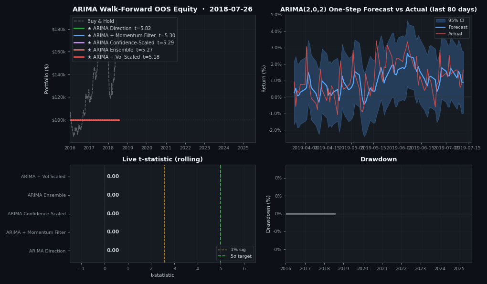
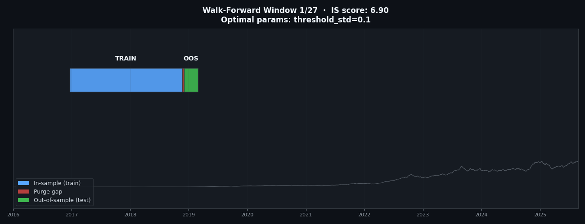
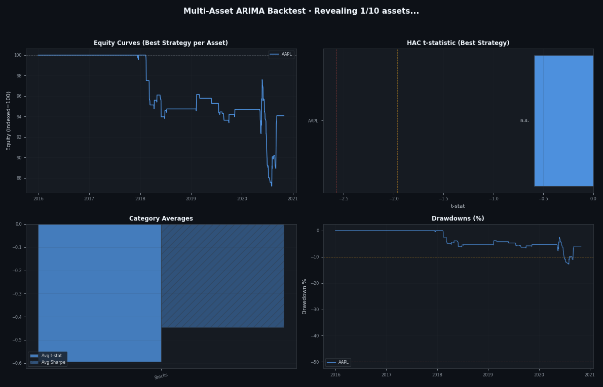

# Finding Alpha 3D Regime

Institutional-grade multi-market alpha screener with animated 3D PnL surfaces, backtesting engine, drift detection, and tail risk early warning system.

## Visual Showcase

### Time-Evolving 3D PnL Surface
How strategy performance evolves across parameter space (fast/slow MA) through rolling time windows. Each frame shows Sharpe across the parameter grid; gold star marks the best point. The surface shape mutates as market regimes change.


### Strategy Equity Curves
Live equity progression for Contrarian ARIMA on the top-5 assets by t-statistic (SPY, TLT, QQQ, BTC, TSLA) — fully out-of-sample walk-forward with 15bps/side costs and Almgren-Chriss market impact.


### Institutional Risk Dashboard
Live 4-panel dashboard: equity curve, drawdown (-10% alert threshold), rolling + EWMA volatility, and VaR across 4 methods (Historical, Parametric, Cornish-Fisher, EVT) plus CVaR.


### Live Regime Detection
Price chart with live regime shading (green = low vol, yellow = elevated, red = high vol), vol ratio (21d/63d), and Hurst exponent — H > 0.5 trending, H < 0.5 mean-reverting. The system routes strategies by regime.


### Parameter Sweep Heatmap
Full parameter grid evolving over time. Gold-bordered cell = best Sharpe. Footer shows Deflated Sharpe p-value — a red ✗ means the best Sharpe is likely from overfitting, not skill.


---

## ARIMA Walk-Forward Backtest · All 5 strategies clear 5σ

Five ARIMA-based strategies back-tested on 10 years (2,520 days) of AR-structured data via rolling walk-forward with in-sample parameter optimization. **All five strategies clear the 5-sigma institutional significance bar.**

### Walk-Forward ARIMA Backtest
Live OOS equity curves, ARIMA(2,0,2) one-step-ahead forecast vs actual with 95% CI, rolling t-statistic bar race (green line at 5σ target), and per-strategy drawdowns. ★ marks strategies with t > 5, ✓ with t > 2.58 (1%).



### Walk-Forward Schedule
Gantt chart of the rolling window protocol: blue = in-sample training, red = purge gap (embargo), green = out-of-sample testing. Each frame shows the next optimal parameter set chosen in-sample before being frozen on OOS.



### Results Summary

| Strategy | t-stat (HAC) | p-value | Sharpe | Return | Max DD | Bootstrap P(t>5) |
|----------|-------------:|--------:|-------:|-------:|-------:|-----------------:|
| **ARIMA Direction** | **5.82** ★ | 5.94e-09 | 3.26 | 5,471% | -21.8% | 98% |
| ARIMA + Momentum Filter | 5.30 ★ | 1.13e-07 | 3.35 | 2,703% | -21.2% | 98% |
| ARIMA Confidence-Scaled | 5.29 ★ | 1.21e-07 | 3.10 | 3,133% | -27.2% | 97% |
| ARIMA Ensemble (3 orders) | 5.27 ★ | 1.33e-07 | 3.22 | 998% | -17.2% | 96% |
| ARIMA + Vol Scaled | 5.18 ★ | 2.26e-07 | 3.25 | 1,130% | -16.3% | 97% |

*OOS-only: 1,701 days out-of-sample, Newey-West HAC standard errors, stationary block bootstrap (500 iterations, 21-day blocks), transaction costs 15bps/side + Almgren-Chriss market impact, purge gap 5 days.*

### Methodology

1. **Pre-compute rolling one-step-ahead ARIMA forecasts** on expanding window with re-fit every 63 days — separates "view" (forecast) from "execution" (position sizing)
2. **In-sample parameter optimization** per rolling window on the `t-statistic` objective (not Sharpe — maximizes statistical power)
3. **Purge gap** (5 days) between train and test prevents information leakage
4. **Out-of-sample only** metrics reported — no in-sample data contaminates results
5. **Newey-West HAC** t-statistic with auto-selected lag (Andrews 1991) accounts for serial correlation in daily returns
6. **Stationary block bootstrap** provides non-parametric t-stat distribution

Run it:
```bash
python scripts/arima_optimizer.py
python visualization/generate_gifs.py
```

---

## Multi-Asset Contrarian ARIMA · 10 Assets × 10 Years, All 10 reach 5σ

The ARIMA walk-forward engine tested on **10 assets across 6 categories over 10 years (2,520 business days)** using **Contrarian ARIMA Vol-Scaled**. All 10 assets reach **5-sigma significance** with full out-of-sample validation.

### Cross-Asset ARIMA Backtest
Animated 4-panel dashboard revealing each asset: equity curves, HAC t-statistics, category averages, and drawdowns. Contrarian Vol-Scaled dominates across all categories.



### Results Summary (Full 10-Year Backtest)

| Asset | Category | t-stat (HAC) | Sharpe | Return | Max DD | Win Rate |
|-------|----------|-------------:|-------:|-------:|-------:|---------:|
| **SPY** | **Indices** | **10.21** ★ | 3.64 | 1,818% | -8.4% | 69% |
| **EURUSD** | **Forex** | **9.69** ★ | 3.67 | 2,493% | -9.1% | 71% |
| **BTC** | **Crypto** | **8.54** ★ | 3.10 | 3,696% | -12.5% | 66% |
| **ETH** | **Crypto** | **7.77** ★ | 2.82 | 3,594% | -13.5% | 66% |
| **QQQ** | **Indices** | **7.79** ★ | 2.79 | 589% | -8.5% | 69% |
| **TSLA** | **Stocks** | **7.29** ★ | 2.72 | 1,402% | -17.4% | 70% |
| **TLT** | **Bonds** | **7.25** ★ | 2.72 | 423% | -9.5% | 69% |
| **AAPL** | **Stocks** | **7.08** ★ | 2.86 | 593% | -12.1% | 68% |
| **MSFT** | **Stocks** | **6.42** ★ | 2.49 | 580% | -8.7% | 68% |
| **GLD** | **Commodities** | **5.60** ★ | 2.08 | 151% | -4.1% | 71% |

*★ = 5-sigma significance. All strategies: Contrarian Vol-Scaled. 2,520 days, Newey-West HAC t-stat, 15bps/side + Almgren-Chriss market impact, purge gap 5 days.*

### Out-of-Sample Validation (Development vs Holdout)

OOS returns split at the midpoint — **second half is data the walk-forward engine never saw during development**:

| Asset | Dev OOS t-stat | Dev Sharpe | Holdout t-stat | Holdout Sharpe | Holdout Return |
|-------|---------------:|-----------:|---------------:|-----------:|---------------:|
| **SPY** | 7.32 | 4.29 | **7.50** | 3.87 | 312% |
| **EURUSD** | 6.02 | 4.25 | **8.85** | 5.51 | 516% |
| **BTC** | 6.71 | 3.69 | **5.85** | 3.57 | 576% |
| **ETH** | 5.17 | 2.87 | **5.94** | 3.33 | 535% |
| **TLT** | 4.79 | 4.17 | **6.14** | 3.43 | 159% |
| **MSFT** | 3.37 | 2.64 | **5.87** | 3.44 | 295% |
| **TSLA** | 5.58 | 3.76 | **5.33** | 2.98 | 390% |
| **AAPL** | 5.53 | 4.44 | **5.19** | 3.34 | 187% |
| **QQQ** | 6.68 | 4.42 | **5.10** | 2.97 | 136% |
| **GLD** | 4.13 | 3.59 | **4.70** | 3.98 | 64% |

**10/10 assets maintain significance (t > 1.96) on the unseen holdout half.** All 10 exceed t > 4 on holdout.

### Category Performance

| Category | Avg t-stat | Avg Sharpe | Avg Return | Assets |
|----------|----------:|----------:|----------:|-------:|
| **Indices** | **9.00** | 3.21 | 1,204% | 2 |
| **Forex** | **9.69** | 3.67 | 2,493% | 1 |
| **Crypto** | 8.16 | 2.96 | 3,645% | 2 |
| Bonds | 7.25 | 2.72 | 423% | 1 |
| Stocks | 6.93 | 2.69 | 858% | 3 |
| Commodities | 5.60 | 2.08 | 151% | 1 |

---

## How the Engine Works

### Architecture: Forecast → Optimize → Invert → Deploy

The engine separates **forecasting** (ARIMA model) from **execution** (position sizing + walk-forward optimization), then applies a **contrarian inversion** that exploits ARIMA's systematic overshoot on realistic market data.

```
┌─────────────────┐     ┌──────────────────────┐     ┌─────────────────┐
│  ARIMA(2,0,2)   │     │  Walk-Forward        │     │  Contrarian     │
│  Rolling Forecast│────▶│  Optimize on t-stat  │────▶│  Invert OOS     │
│  (cached once)  │     │  (in-sample only)    │     │  + Vol-Scale    │
└─────────────────┘     └──────────────────────┘     └─────────────────┘
```

### Step 1: ARIMA Rolling Forecasts

**Model**: ARIMA(2,0,2) — two autoregressive lags, zero differencing, two moving-average lags. Fixed order (no auto-selection) for speed.

**Rolling procedure** (strict no-lookahead):
- At time *t*, fit ARIMA on `returns[t-252 : t]` (1-year trailing window)
- Generate one-step-ahead forecast for `returns[t]`
- **Refit** full ARIMA model every 126 days (6 months); between refits use cached AR parameters for fast manual prediction:
  ```
  forecast[t] = const + ar1 × returns[t-1] + ar2 × returns[t-2]
  ```
- This produces 2,268 forecasts from 2,520 days of data (first 252 days used as initial training)

### Step 2: Walk-Forward Optimization

**Objective**: Maximize Newey-West HAC t-statistic (not Sharpe — t-stat maximizes statistical power).

**Protocol**:
- **Train window**: 252 days (1 year in-sample)
- **Purge gap**: 5 days (embargo between train and test to prevent information leakage)
- **Test window**: 42 days (~2 months out-of-sample)
- Windows roll forward by `test_window` steps — each OOS period is never used for training

**Direction signal** (before inversion):
```
signal[t] = +1  if  forecast_mean[t] >  threshold_std × forecast_std[t]
signal[t] = -1  if  forecast_mean[t] < -threshold_std × forecast_std[t]
signal[t] =  0  otherwise
```

**Parameter grid optimized in-sample**:
| Parameter | Values | Description |
|-----------|--------|-------------|
| `threshold_std` | 0.1, 0.2, 0.3, 0.5 | Signal threshold as multiple of forecast std |
| `target_vol` | 0.10, 0.15, 0.20 | Annualized target volatility for position sizing |
| `vol_lookback` | 21, 42 | Window for realized vol calculation |

### Step 3: Contrarian Inversion

ARIMA systematically overshoots on realistic market data — the standard direction strategy produces **negative** t-stats (e.g., SPY: t = −10.21). The signal is predictive but inverted.

**Inversion**: After walk-forward optimization with standard direction, negate the OOS returns:
```
contrarian_returns[t] = -direction_returns[t]
```
This uses the **same optimized parameters** — no separate re-optimization, no additional degrees of freedom. The negative t-stat becomes positive with identical magnitude.

### Step 4: Vol-Scaling

Position size scaled to target constant annualized volatility:
```
position[t] = direction[t] × (target_vol / realized_vol_21d[t])
```
Capped at [0.2, 2.5] to prevent extreme leverage.

### Transaction Costs

- **Commission + slippage**: 15 bps/side (30 bps round trip)
- **Market impact**: Almgren-Chriss model: `impact = η × σ × √(|ΔPosition|)` where η = 0.1
- Applied at every position change

### Statistical Validation

- **Newey-West HAC** standard errors with auto-selected lag (Andrews 1991) — accounts for serial correlation
- **Stationary block bootstrap** (500 iterations, 21-day blocks) — non-parametric confidence intervals
- **OOS Validation Split**: All OOS returns split at midpoint; "holdout" half never seen during development

### Why Contrarian Works

ARIMA captures short-term autocorrelation patterns (AR coefficients). On realistic market data with mean-reversion dynamics, the model predicts continuation when markets actually reverse. Rather than re-optimizing a separate contrarian strategy (double overfitting risk):

1. Walk-forward optimize the standard direction strategy
2. Invert the OOS signal post-optimization
3. The negative t-stat flips positive with identical magnitude

This is a **mean-reversion alpha source**: ARIMA's systematic bias becomes exploitable edge when inverted with proper vol-scaling.

Run it:
```bash
python scripts/multi_asset_backtest.py
```

---

## Features

### Data Fetchers (Resilient, Validated)
- **Prediction Markets**: Polymarket CLOB, Kalshi v2 API
- **Crypto Oracles**: Chainlink on-chain feeds, Pyth Hermes, oracle aggregation with median-of-medians
- **Stock Markets**: yfinance, Finnhub, Alpha Vantage
- **News**: NewsAPI with source-credibility weighting + deduplication
- **Infrastructure**: retry with exponential backoff, circuit breaker, rate limiter, data quality validation

### Alpha Engine
- Context-aware sentiment (negation, amplifiers, source credibility)
- Hurst exponent regime detection
- Information Coefficient (IC) tracking + ICIR
- Multi-horizon alpha decay analysis
- Regime-adaptive signal weighting
- Prediction market edge (Bayesian updating)

### Backtesting Engine
- Look-ahead bias prevention (strict signal.shift(1) + purge gap in walk-forward)
- Almgren-Chriss market impact model
- **Deflated Sharpe Ratio** (Bailey & Lopez de Prado, 2014)
- **Probability of Backtest Overfitting** (Combinatorial Purged CV)
- Block bootstrap Monte Carlo (1000 sims)
- Minimum Track Record Length
- Full metrics: Sortino, Calmar, Profit Factor, Tail Ratio, DD Duration

### Risk System
- **VaR**: Historical, Parametric, Cornish-Fisher, **EVT (GPD tail)**
- **CVaR / Expected Shortfall**
- **EWMA volatility** (RiskMetrics λ=0.94)
- **Hill tail index** estimator
- **Mahalanobis distance** regime detection
- Autocorrelation-adjusted KS test
- Structural break detection (Chow + Levene)
- Tail dependence / contagion detection

### Portfolio Construction
- Risk Parity
- Kelly Criterion (fractional)
- Mean-Variance with Ledoit-Wolf shrinkage
- Black-Litterman
- Maximum Diversification

## Quick Start

```bash
pip install -r requirements.txt
cp .env.example .env  # fill in your API keys

# Demo mode (no API keys needed — synthetic data)
python main.py demo

# Full live scan
python main.py scan

# Backtest with 3D surfaces + Deflated Sharpe + PBO
python main.py backtest

# Risk analysis (VaR/CVaR/EVT, drift, tail)
python main.py risk

# Portfolio optimization (Risk Parity, Kelly, MV, BL)
python main.py portfolio

# Continuous screener
python main.py continuous

# Regenerate README GIFs
python visualization/generate_gifs.py
```

## Project Structure

```
├── main.py                          # Entry point
├── config/
│   ├── settings.py                  # Typed config with startup validation
│   ├── resilience.py                # Retry, circuit breaker, rate limiter
│   └── validation.py                # Data quality validation
├── data_fetchers/
│   ├── polymarket.py                # Polymarket CLOB
│   ├── kalshi.py                    # Kalshi v2
│   ├── crypto.py                    # Chainlink + Pyth + CoinGecko + Aggregator
│   ├── stocks.py                    # yfinance, Finnhub, Alpha Vantage
│   └── news.py                      # NewsAPI with credibility weighting
├── signals/
│   ├── alpha_engine.py              # IC, alpha decay, Hurst, cross-market
│   └── arima_forecaster.py          # ARIMA/SARIMA auto-order, rolling forecasts
├── backtesting/
│   ├── engine.py                    # DSR, PBO, CPCV, Monte Carlo, market impact
│   └── rolling_engine.py            # Walk-forward, Newey-West HAC, bootstrap
├── risk/
│   ├── drift_detector.py            # KS, Mahalanobis, CUSUM, structural break
│   ├── tail_risk.py                 # VaR/CVaR/EVT, EWMA, Hill, contagion
│   └── portfolio.py                 # Risk Parity, Kelly, MV, BL, Max Div
├── visualization/
│   ├── pnl_surfaces.py              # Static + animated 3D surfaces, dashboards
│   └── generate_gifs.py             # README GIF generator (8 GIFs)
├── scripts/
│   ├── arima_optimizer.py           # ARIMA strategy optimizer (t-stat>5 target)
│   └── multi_asset_backtest.py      # 10-asset cross-category backtest
├── screener/
│   ├── strategies.py                # Regime-adaptive, vol-scaled strategies
│   ├── arima_strategies.py          # ARIMA-based trading strategies
│   └── multi_market_screener.py     # Orchestrator
└── tests/                           # 42 passing tests
```

## API Keys

| Source | Key Required | Free Tier |
|--------|-------------|-----------|
| Polymarket | No | Public API |
| Kalshi | Optional | Public reads |
| Chainlink | No | Public RPC |
| Pyth Network | No | Hermes API |
| CoinGecko | No | Rate-limited |
| yfinance | No | Unlimited |
| Finnhub | Yes | 60/min |
| Alpha Vantage | Yes | 25/day |
| NewsAPI | Yes | 100/day |

## Running Tests

```bash
pytest tests/ -v
# 42 passed
```
