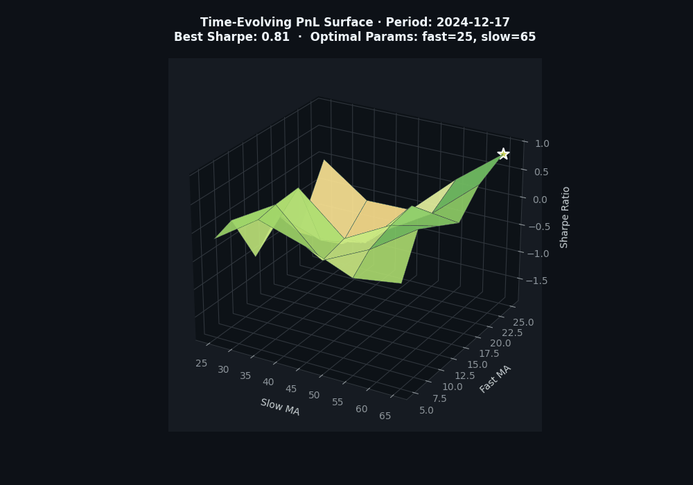
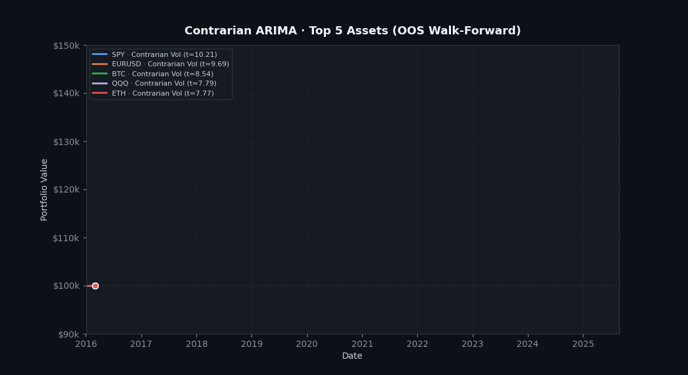
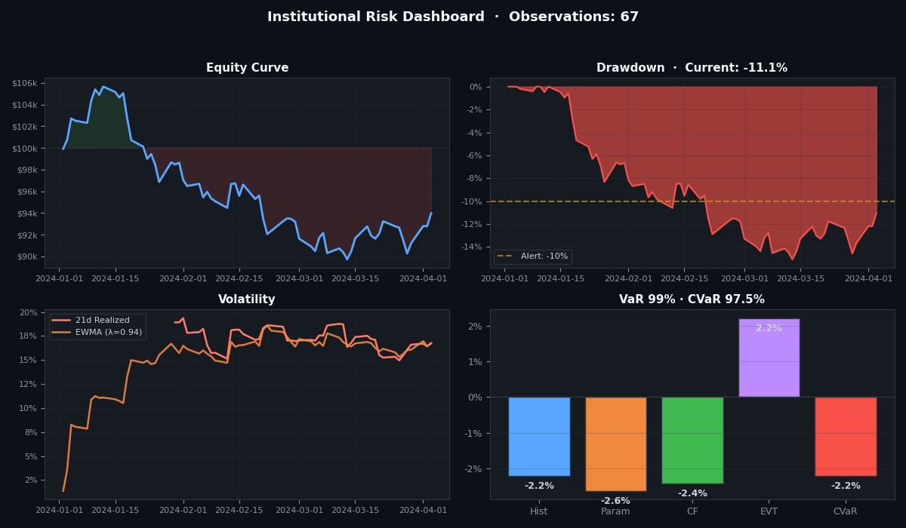
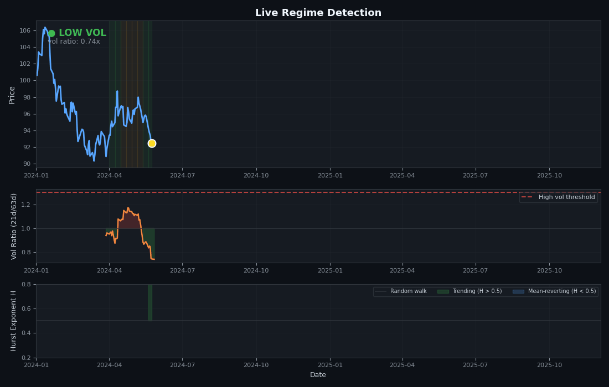
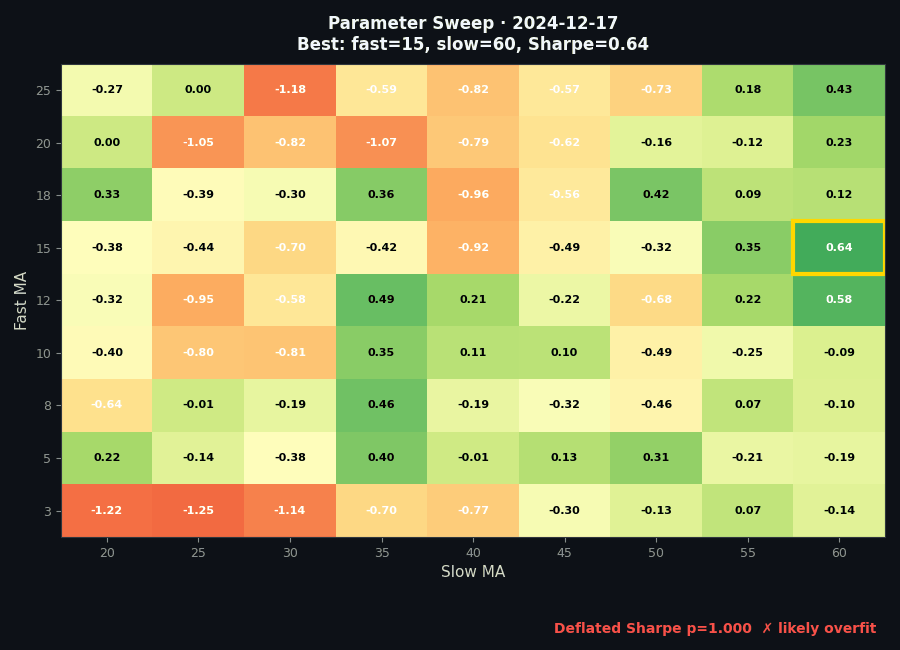

# Finding Alpha 3D Regime

Institutional-grade multi-market alpha screener with animated 3D PnL surfaces, backtesting engine, drift detection, and tail risk early warning system.

## Visual Showcase

### Time-Evolving 3D PnL Surface
How strategy performance evolves across parameter space (fast/slow MA) through rolling time windows. Each frame shows Sharpe across the parameter grid; gold star marks the best point. The surface shape mutates as market regimes change.



### Strategy Equity Curves
Side-by-side equity progression for Momentum, Bollinger Mean-Reversion, and Regime-Adaptive strategies vs. buy-and-hold — including realistic transaction costs and Almgren-Chriss market impact.



### Institutional Risk Dashboard
Live 4-panel dashboard: equity curve, drawdown (-10% alert threshold), rolling + EWMA volatility, and VaR across 4 methods (Historical, Parametric, Cornish-Fisher, EVT) plus CVaR.



### Live Regime Detection
Price chart with live regime shading (green = low vol, yellow = elevated, red = high vol), vol ratio (21d/63d), and Hurst exponent — H > 0.5 trending, H < 0.5 mean-reverting. The system routes strategies by regime.



### Parameter Sweep Heatmap
Full parameter grid evolving over time. Gold-bordered cell = best Sharpe. Footer shows Deflated Sharpe p-value — a red ✗ means the best Sharpe is likely from overfitting, not skill.



---

## Features

### Data Fetchers (Resilient, Validated)
- **Prediction Markets**: Polymarket CLOB, Kalshi v2 API
- **Crypto Oracles**: Chainlink on-chain feeds, Pyth Hermes, oracle aggregation with median-of-medians
- **Stock Markets**: yfinance, Finnhub, Alpha Vantage
- **News**: NewsAPI with source-credibility weighting + deduplication
- **Infrastructure**: retry with exponential backoff, circuit breaker, rate limiter, data quality validation

### Alpha Engine
- Context-aware sentiment (negation, amplifiers, source credibility)
- Hurst exponent regime detection
- Information Coefficient (IC) tracking + ICIR
- Multi-horizon alpha decay analysis
- Regime-adaptive signal weighting
- Prediction market edge (Bayesian updating)

### Backtesting Engine
- Look-ahead bias prevention (strict signal.shift(1) + purge gap in walk-forward)
- Almgren-Chriss market impact model
- **Deflated Sharpe Ratio** (Bailey & Lopez de Prado, 2014)
- **Probability of Backtest Overfitting** (Combinatorial Purged CV)
- Block bootstrap Monte Carlo (1000 sims)
- Minimum Track Record Length
- Full metrics: Sortino, Calmar, Profit Factor, Tail Ratio, DD Duration

### Risk System
- **VaR**: Historical, Parametric, Cornish-Fisher, **EVT (GPD tail)**
- **CVaR / Expected Shortfall**
- **EWMA volatility** (RiskMetrics λ=0.94)
- **Hill tail index** estimator
- **Mahalanobis distance** regime detection
- Autocorrelation-adjusted KS test
- Structural break detection (Chow + Levene)
- Tail dependence / contagion detection

### Portfolio Construction
- Risk Parity
- Kelly Criterion (fractional)
- Mean-Variance with Ledoit-Wolf shrinkage
- Black-Litterman
- Maximum Diversification

## Quick Start

```bash
pip install -r requirements.txt
cp .env.example .env  # fill in your API keys

# Demo mode (no API keys needed — synthetic data)
python main.py demo

# Full live scan
python main.py scan

# Backtest with 3D surfaces + Deflated Sharpe + PBO
python main.py backtest

# Risk analysis (VaR/CVaR/EVT, drift, tail)
python main.py risk

# Portfolio optimization (Risk Parity, Kelly, MV, BL)
python main.py portfolio

# Continuous screener
python main.py continuous

# Regenerate README GIFs
python visualization/generate_gifs.py
```

## Project Structure

```
├── main.py                          # Entry point
├── config/
│   ├── settings.py                  # Typed config with startup validation
│   ├── resilience.py                # Retry, circuit breaker, rate limiter
│   └── validation.py                # Data quality validation
├── data_fetchers/
│   ├── polymarket.py                # Polymarket CLOB
│   ├── kalshi.py                    # Kalshi v2
│   ├── crypto.py                    # Chainlink + Pyth + CoinGecko + Aggregator
│   ├── stocks.py                    # yfinance, Finnhub, Alpha Vantage
│   └── news.py                      # NewsAPI with credibility weighting
├── signals/alpha_engine.py          # IC, alpha decay, Hurst, cross-market
├── backtesting/engine.py            # DSR, PBO, CPCV, Monte Carlo, market impact
├── risk/
│   ├── drift_detector.py            # KS, Mahalanobis, CUSUM, structural break
│   ├── tail_risk.py                 # VaR/CVaR/EVT, EWMA, Hill, contagion
│   └── portfolio.py                 # Risk Parity, Kelly, MV, BL, Max Div
├── visualization/
│   ├── pnl_surfaces.py              # Static + animated 3D surfaces, dashboards
│   └── generate_gifs.py             # README GIF generator
├── screener/
│   ├── strategies.py                # Regime-adaptive, vol-scaled strategies
│   └── multi_market_screener.py     # Orchestrator
└── tests/                           # 42 passing tests
```

## API Keys

| Source | Key Required | Free Tier |
|--------|-------------|-----------|
| Polymarket | No | Public API |
| Kalshi | Optional | Public reads |
| Chainlink | No | Public RPC |
| Pyth Network | No | Hermes API |
| CoinGecko | No | Rate-limited |
| yfinance | No | Unlimited |
| Finnhub | Yes | 60/min |
| Alpha Vantage | Yes | 25/day |
| NewsAPI | Yes | 100/day |

## Running Tests

```bash
pytest tests/ -v
# 42 passed
```
